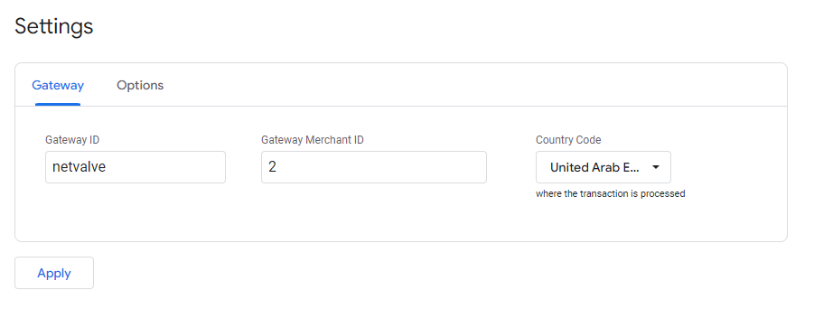
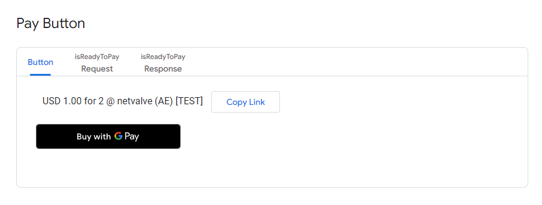
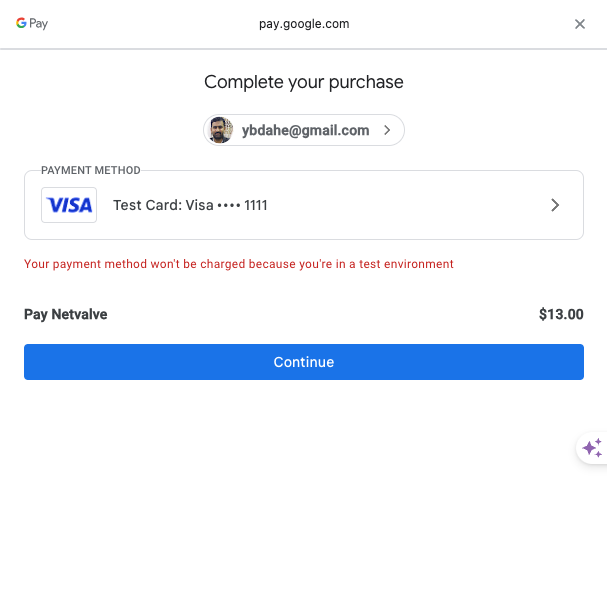
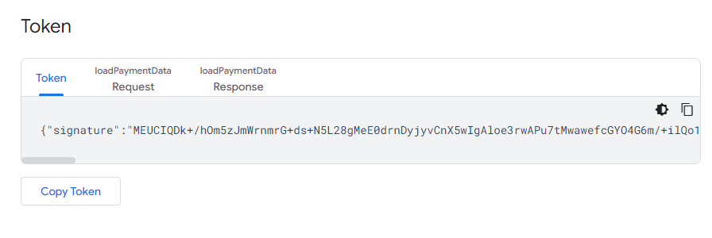

# Google Pay™ Integration

## Overview

This document provides guidance for integrating Google Pay™ into your payment processing system. Google Pay™ facilitates swift and secure transactions for your customers, whether they are using your Android app or website. This guide outlines the necessary steps for integration, including prerequisites, transaction processing, supported card parameters, and error handling.

## Prerequisites

Before integrating Google Pay™ into your Android app or website, ensure you have the necessary prerequisites in place:

### Android App

For Android app integration, refer to the:
- [Google Pay Android developer documentation](https://developers.google.com/pay/api/android/);
- [Google Pay Android integration checklist](https://developers.google.com/pay/api/android/guides/test-and-deploy/integration-checklist);
- [Google Pay Android brand guidelines](https://developers.google.com/pay/api/android/guides/brand-guidelines).

### Web Merchants

For Web merchants, refer to the:
- [Google Pay Web developer documentation](https://developers.google.com/pay/api/web/);
- [Google Pay Web integration checklist](https://developers.google.com/pay/api/web/guides/test-and-deploy/integration-checklist);
- [Google Pay Web Brand Guidelines](https://developers.google.com/pay/api/web/guides/brand-guidelines).

## Transaction Processing

### Google Pay Web Integration - Generate Tokens

On this link you can generate token: [Google token generator](https://developers.google.com/pay/api/processors/guides/test-and-validation/token-generator).



Fill the fields following these guidelines:

- **Gateway ID**: netvalve;
- **Gateway Merchant ID**: merchant id, netvalve merchant id or site id. If you don’t have this information contact the NetValve support team;
- For testing with **Google test cards**, you should join the test group on this link [Test with sample credit cards](https://groups.google.com/g/googlepay-test-mode-stub-data);
- Click the **Apply** button, then go to the next section and click the **Buy with G Pay** button:



- Choose the payment method and click the **Continue** button:



- As a response, Google will provide the <code>PaymentData</code> item. There, in the <code>paymentMethodData.tokenizationData.token</code> field, you can find the encrypted **Google Pay Token** (a string of characters).

```json title="Sample Google Pay Token"
{
    "signature": "MEUCIQDY3wBQyHB4sZcktRoJXKxm+OLcjHzCvdDeGn23oX0kkwIgKznRFZZL+sDMv1b5cuD+YurXMZraYBsr9hbravVY5Ro\u003d",
    "protocolVersion": "ECv1",
    "signedMessage": "{\"encryptedMessage\":\"cI87tLqzqTGyCFnMMCVWcTHw3xhYIK+CEnuQ74K+nlLpCgOlfpScib9jds4sxDtN6CunCqCSMfd/3yHeeRy6aCx1yyqcT4ey6NueeBznprJpkmVVgI1JHWLQt4hzAXMUAcYASYLOabKP9fUZvHkOBDytD531jpzNXa+Spc/zrpGzFKx2C4VU9sC95q9i+ey+kr7ZMNVCOFJPWXu7lKZ105IOOqozJ6/70MKmxP3jM89eeq+/19QnyHjQLXfnQPvQjiUJKGCcRKDLlrb3XoY5ZUUzGfN5eZCLzCVg0hWEbwU+6J7KWYJyW+Wr1r8bagN9zWsrMKhDpsQbHfyzb+yBzFUoxeUgL4a7FeVvEllIcHtqsvTCf6FENV20aF5VLDv5qzUkV+PzTAIbFEuabA0God9UbVCVVv7nM8QFzvRPhzYYFVFTn4JHvL2qZ4pAR9lE+w\\u003d\\u003d\",\"ephemeralPublicKey\":\"BPHLC4sBHpenY1M0ixmiDMuWJTaTJOqggRUwtgBJMcBp28VsxHD7zPI7985x4F5EjMP5y8j/cuUzbe/cGPjOKGk\\u003d\",\"tag\":\"RaXrPOUuc5iw3oxDa0C2MOjaKxgxIRQvwOspmtFV0zU\\u003d\"}"
}
```

Copy the token and insert it in the Token section:



### Sample Payload

```json
{
"amount": 999.00,
"cardHolderName": "Yogesh",
"clientOrderId": {{clientOrderId}},
"currency": "USD",
"customerAddress": "Skopje",
"customerCity": "Skopje",
"customerCountryCode": "US",
"customerEmail": "yogesh@dahe.com",
"customerIp": "123.123.123.123",
"customerName": "Yogesh",
"customerLastName": "Dahe",
"customerPhone": "+3123123112312",
"customerState": "Mkd",
"customerZipCode": "1000",
"netvalveMidId": 2, //Please use your netvalve mid id or site id
"paymentType": "WALLET",
"walletType": "GOOGLE_PAY",
"googlePaySSL": 

//Add you Google token here...

}
```

### Success Criteria
- <code>responseCode - GTW_1000</code>

### Example Request with a Token

```json
{
   "amount":999.00,
   "cardHolderName":"Yogesh",
   "clientOrderId":{{clientOrderId}},
   "currency":"USD",
   "customerAddress":"Skopje",
   "customerCity":"Skopje",
   "customerCountryCode":"US",
   "customerEmail":"yogesh@dahe.com",
   "customerIp":"123.123.123.123",
   "customerName":"Yogesh",
   "customerLastName":"Dahe",
   "customerPhone":"+3123123112312",
   "customerState":"Mkd",
   "customerZipCode":"1000",
   "midId":2,
   "paymentType":"WALLET",
   "walletType":"GOOGLE_PAY",
   "googlePaySSL":{
      "signature":"MEUCIQDk+/hOm5zJmWrnmrG+ds+N5L28gMeE0drnDyjyvCnX5wIgAloe3rwAPu7tMwawefcGYO4G6m/+ilQo1DqnphVIJ/s\u003d",
      "intermediateSigningKey":{
         "signedKey":"{\"keyValue\":\"MFkwEwYHKoZIzj0CAQYIKoZIzj0DAQcDQgAE0NSQX6HDOtKu3B2TI9HJV3IjiRQdebbCcDR9lVkx51TeIZ/J8lGDFcpqZTkNED1g5QXgTqq5ALpG+d43cQRaQA\\u003d\\u003d\",\"keyExpiration\":\"1715897257675\"}",
         "signatures":[
            "MEYCIQCUGkX7SGY6WG94ZHuKfyQpHG6o2KbL1gYmB8aZPRebmwIhAMH61R36CiPbPhY3oohvt6pw3ZQJkYDWFDB6SHpFABTA"
         ]
      },
      "protocolVersion":"ECv2",
      "signedMessage":"{\"encryptedMessage\":\"Syk7ZTw7KzXS6rEisGPZlHTEgpIlH5Z5HJktPKcYHrPWcVh+d4l1MroajG5NQPEOgYxlZV9A4XXq2ZdM/2H/wge9aSCDzY9iY8m2JCMK1SoZVrnD5+dy66iG93VFuAdUjf+ZiddsWDRR1cLyyz/IudsNKaIKKzJNFHk+pCFktklMhvSSaGoDJbKxMqEDuipk6E+R2sAEkBBuKD8zdlzn1xheLnv+MMULUqe7XJTqcCiAJajqMBTFpnyQX3gxd28QwFKu2FX2mYsviR7VsxPnETlSvnabHpcxkLv8EL0mqkGM5hicmjfjEbEKeb2ZXkULBTxipfeHf5eSXo+MyCoo8W5Q+8SvwE9x22KaxJy0A3vPAfgQOK568y+riM+yfP7xt5lWCrCr0rKhepeT+JDEZHdT3gUMlMLdmtzlyT7r6ddtftMkTYzq5BneBFHqYl7uryRh9lFsjSrDjoZQjUGzASPQX+s3ty593Y/1t88fXCNV2xf3PHkpMFq9ZaTKwv1XyHs0uXgawVr2+DVnXcqxfteM5GvpxN42EDlz\",\"ephemeralPublicKey\":\"BOmikxGNXx91S5MftOqKFwqbpiGUr8HfN0zAry5iN4T9LtwtklyG7vS1BsU2YJFaggu5GmuLhA9vFgfvKIPnNUI\\u003d\",\"tag\":\"kJSe9C2RkVCpGt5WCzIZgYnBbywF+pc5LdlUzo43NZw\\u003d\"}"
   }
}
```

### Example Response

```json
{
    "traceID": "b126345b-6199-4635-9bf2-f9aadbdd4d58",
    "responseTimestamp": "2024-11-08T12:57:41.771+00:00",
    "transactionID": 18749,
    "responseCode": "GTW_1000",
    "responseMessage": "Transaction Approved/ Request Successful.",
    "responseCodeType": "APPROVED",
    "paymentMethod": "GOOGLE_PAY",
    "cardNumber": "411111******1111",
    "cardType": "VISA",
    "bankTransactionId": "431312750166",
    "authCode": "TAS213",
    "midId": 2,
    "netvalveMidId": "289e253d-f955-4e29-a2c7-bb1805883ee0"
}
```

## Card Parameters

Google Pay™ transactions do not require a billing address. Therefore, no billing address parameters need to be provided with a card.

### Supported Card Authentication Methods

Google Pay™ supports the following card authentication methods:

- PAN_ONLY;
- CRYPTOGRAM_3DS.

### Supported Card Networks

Google Pay™ supports transactions with cards from the following networks:

- AMEX;
- DISCOVER;
- MASTERCARD;
- VISA.

## Enable Google Pay on Hosted Payment Page

In order to use Google Pay on a Hosted Payment Page, it is required to enable the option on the Backoffice and add a private key.

## Testing

Google Pay™ is available for testing in a Sandbox environment. Ensure to indicate the test environment openly during the integration process. Contact the NetValve support department for assistance with the Sandbox environment registration and integration involving the Google Pay payment method.