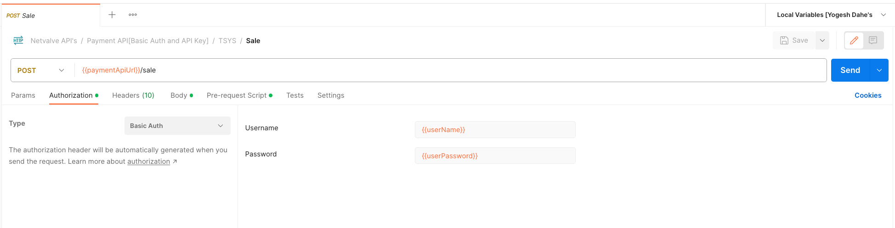
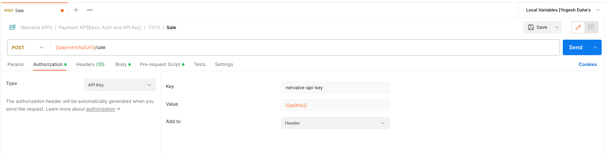
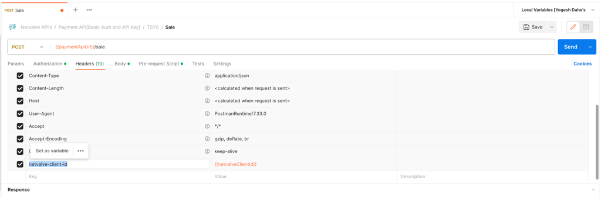

# NetValve API Authentication

This document describes the authentication methods available for interaction with the NetValve APIs. 

NetValve supports two ways of authentication **Basic Auth** and via an **API Key**.

## Basic Auth

The client needs to send <code>userName</code> and <code>password</code> details in the **Authorization header**.  

## API Key Authentication

The client needs to send <code>apiKey</code> in the **Authorization header** and an extra header as <code>netvalve-client-id</code> parameter.

