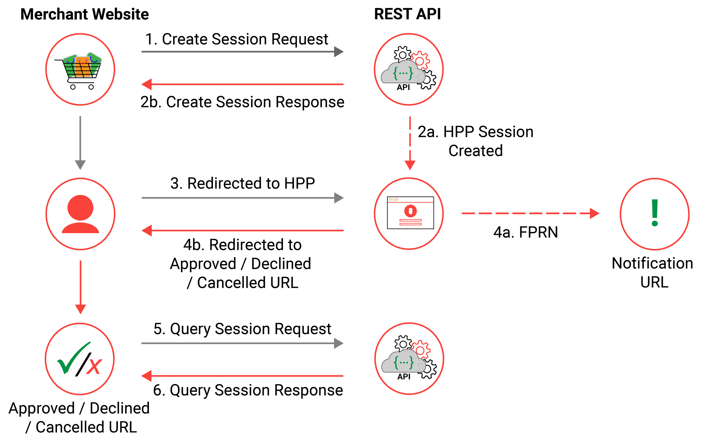
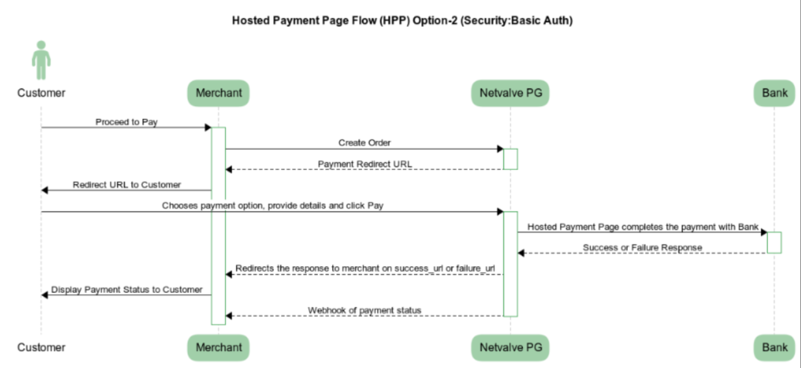
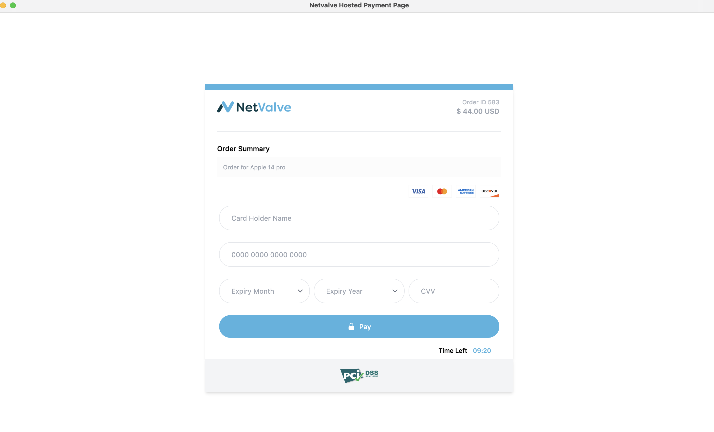

# Hitpixel NetValve Payment Gateway HPP API Integration

This document describes the integration steps for NetValve Payment Gateway HPP API. 

:::info
 Contact the NetValve team to ensure the Hosted Payment Page (HPP) configuration steps have been completed and you have credentials for the HPP [API authentication](api-authentication.md).
:::

## Flow

NetValve Payment Gateway HPP Flow

In the NetValve gateway, we offer a Hosted Payment Page (HPP) to merchants. This HPP operates in two modes: slim_mode, which is designed to be used with an IFRAME, and the other mode is a full-page redirect.



### HPP Transaction States


### Sequence Diagram



### Payment Page



## Integration 

Prerequisites:

1. You need API credentials from NetValve team to access the APIs.
2. Supported payment options (card, apple pay, google pay)
3. For digital wallets, additional configurations are required. Request NetValve team if you need to enable digital wallets.

### Step 1: Create Order API

- Create Order

API URL: [hppApiUrl/hpp/order](/api#tag/Hosted-Payment-Page/operation/createOrder) <br />
HTTP Method: POST<br />
Request Body: JSON

```json title="Example Request"
{
    "amount": 44.00,
    "currency": "USD",
    "midId" : {{midId}},
    "clientOrderId": {{clientOrderId}},
    "orderDesc": "Test",
    "successUrl": "https://website.com/success.html",
    "cancelUrl": "https://website.com/cancel.html",
    "failedUrl": "https://website.com/failed.html",
    "pendingUrl": "https://website.com/pending.html",
     "customerDetails": {
        "customerAddress": "Test",
        "customerCity": "Test",
        "customerCountryCode": "IN",
        "customerEmail": "test@test.com",
        "customerIp": "123.123.123.123",
        "customerName": "Test",
        "customerLastName": "Test",
        "customerPhone": "+919900000000",
        "customerState": "MH",
        "customerZipCode": "123456"
    }
}
```

:::note
**As a new 3DS Visa mandate, the customer needs to send an email and phone in the below format to avoid 3DS compliance issues.**
:::

```json title="3DS Compliance requirements"
    "customerEmail": "yogesh@dahe.com",
    //(Customer Phone in the format of countrycode-phone . e.g +919900000000)
    "customerPhone": "+919900000000", 
```

### Step 2: Redirect Customer to NetValve Hosted Payment Page

When the order has been successfully created, you need to redirect the customer to the NetValve Gateway for payment collection.  

```json title="Create Order API Example Response"
{
    "traceID": "98e151b7-fca4-4e2a-8597-ab58512f2d41",
    "responseTimestamp": "2025-09-09T06:54:38.626+00:00",
    "orderId": 123445,
    "transactionID": ZZZZ,
    "responseCode": "GTW_1000",
    "responseMessage": "Transaction Approved/ Request Successful.",
    "orderState": "CREATED",
    "redirectUrl": "https://checkout.uat.sandbox-netvalve.com?paymentToken=eyJlcGsiOnsia3R5IjoiRUMiLCJjcnYiOiJQLTI1NiIsIngiOiJPZzkzT2RrVF9nRTJWVTN3TS1IYmNqUFcxUkhfcll2bDc1NG5BajYzRHRjIiwieSI6ImxVMjBMOG9vcW5HRnJjOS1RTHlMX0ZxaG5qR1A2N2Qzb1lURjF0cDlaczgifSwiZW5jIjoiQTI1NkdDTSIsImFsZyI6IkVDREgtRVMrQTI1NktXIn0.QCQDTPaQZ-hps8FLbgKJWHHKK3jvxQtfDEhO4pdHYblyJVxnkgnv0A.EAmkgvA4QbC6A-zg.wVt5IlpmGGzU2EWlz21HEzgfepOWC7CLjohxiE6RvNkrxqzlC776QqiSDxpUlDzTF5TmUithajIWO1sLFdKfEG8YkpqA8isn-ZYWggDm-RWcoVThdLT2OGcA4LtdD69R42qpILP4EsexlvBaQbhXEHwymapaLGxgpzPKae3oGO6ZfhFdMC84LlTt1QdK-cX8lJauMttihmhTEG1iI4Qsarjqu-kJGV3NffB1nPfpH5CoYAYfV_9SJxhCHnb2xuduBVAiBQiWfT_UrVXmFBDz5iJOV3tQ7wGvOkyL_J4DpjtgWrRX64OVfv2ts0eOhrrnhi5uUALtHsOcvEKrqTxXJtSdDgF7L3JE0c4I1F3uJxqKEhPxtKyJDSuYH5R9TQyvdfVk43Hkaj23vOtUhy6UlG-IOObAmxT4Pu2jzqacUXLscZJGPMUcjE-F8IlL0dl6bHMdBlhNepwACHr9cSyw46FzuyFI0EnKsENbDhdooJCrI3AbavPvoVDN2-zrFuWl1PZCkV5mqwF9MxW-3Lt11ac1a1KdBebdMmVP5L2zMBMi-3qP-aiSH6Sk23x4uOh6Idb5VcKcd5pfLV7qq8cb5bF8uJSLXOg8bQYv__vs5Ic0XtrVRPFiMH9_VO98PxXZZXQpImaoBZhXc5sQU_hcXlxG2pLhKj_POQizH5X2RHm79Aateoo-lK5baiNNxm7vlPaIC1fw7nUEGYjYgPUboly3BfYOu22wIt7ZVZrrsb_h54Av5ShHJJxvZNXRjLvFi67JYKt_j6Upzxb-a1pBGM4uddsLN1_7yhJ2zNDhKUPz0C1FIsW20iLy7JkrZL6sElX4CfXvWMss5gfXfE8Tw1bL9WC_eGV05rC1zXQAwgOUVCGiodWnI-tXdZ_qsxqWtIiBsEJiO0BycI2ThIvsAj--6PJwl-bHLPfTBvmyZNK5GXb7KUrUMkNcnPIVPdoErYZPVwnYwF0zPaa9dvbo4oTxMKIVCElgpY-CUMEvFcGZ_vIG7DFnxjAkiMo-IuC0_4h981eAETGmQiRa80U10uenzo1yDoIvnosWTd1ot631Pts6_lnkrCTr2lgFKmkEvk3BWVY7ikutmS98A-CbGrMT5XfvdHDpxapzd5X2MGZyL1t0NIqgaQW7W9FyUKXRtMZaXyrW2sKQNeK9ZgfSIC9yOm0Ex2P-k4V-Qp0fSGxgyN_5RwHSFUom6L7K9zjZkuQLQ0KxkMdSZeYjCfegtM-3FST3lDsTun_TOTemkC6Jzq98bFEgCM016NMGow-s2u36rsvez5hWJJ9AbuD_xhrRdi0FQ-9LyVl4H8lXrQOs.Ef8VsHW1id7eSvS3h_hJSw&language=en",
    "midId": YYYY,
    "netvalveMidId": "XXXXX"
}
```

#### Additional Instructions

1. Ensure that responseCode = "GTW_1000" for successful order creation.
2. For specific payment option to be displayed, you can include optional parameter in the query param  "&paymentOption=applepay" to the redirectUrl URL in the response.

Possible values: This is optional to manage the payment options to be displayed in the payment page:

- Option1: All available payment options: paymentOptions=applepay,googlepay,card or 
- Option2 Only digital wallets option in the payment page: paymentOptions=applepay,googlepay
- Option3 Only apple pay option in the payment page: paymentOptions=applepay 
- Option4: Only google pay option in the payment page paymentOptions=googlepay.

### Step 3: Receive Response

Once the user completes the payment, NetValve will redirect the customer to one of the following URLs, based on the status:

- For Successful payment, user will be redirected to successUrl;
- For Cancel payment, user will be redirected to cancelUrl;
- For Failed payment, user will be redirected to failedUrl;
- For Pending payment,  user will be redirected to pendingUrl.

### Step 4: Webhook (optional)

You can receive a webhook from NetValve upon completion of the payment. This will be server to server call from NetValve to your URL. 

For webhook configuration details, you need to reach out to the NetValve team. For more details on the webhook refer to the [Webhook Message](../webhook-msg.md) document.

### Exception Cases

For any reason, if you are not able to get a valid response or transaction status from the gateway

then you can use inquiry API to check the status of the transaction:

For detailed information on the request and response structure for the aforementioned APIs, please refer to our [Swagger API documentation](/api).

### Pending Response

In this case the merchant should do the inquiry again.

```jsx title="Example Pending Response"
{
    "traceID": "965c2c75-b29d-41fc-aa3a-6d40b9f3fbb0",
    "responseTimestamp": "2024-04-25T13:48:49.959+00:00",
    "transactionID": 22,
    "responseCode": "GTW_1002",
    "responseMessage": "Transaction status is Pending.",
    "responseCodeType": "PENDING"
}
```

### API Error Codes

Please refer to [this document](errorcodes.md) for a list of all API response codes and their description.