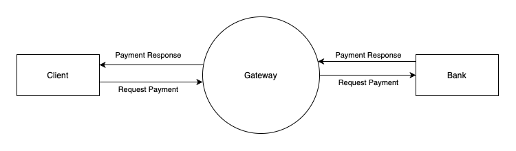

import DocCardList from '@theme/DocCardList';

# Hitpixel NetValve Payment gateway API Integration

This document describes the integration steps for NetValve Payment Gateway API. 
:::info
Contact the NetValve team to ensure you have credentials for the API authentication.
:::

## Flow

Netvalve Payment Gateway API



## Integration 

### Transactional APIs

- Authorization transaction
- Capture / Settlement transaction
- Sale transaction
- Refund transaction
- Rebill / Recurring transaction
- Cancel / Void transaction

### Enquiry APIs

- Get All Orders
- Get Order
- Get All Transactions
- Get Transaction
- Get Transaction result (inquiry)

For any reason, if you are not able to get a valid response or transaction status from the gateway like below, you can call inquiry API for transaction result status.

```json title="Example Response"
{
    "traceID": "8baeb75c-044f-43bb-a874-ce71049533a6",
    "responseTimestamp": "2024-11-08T12:38:58.140+00:00",
    "transactionID": 18747,
    "responseCode": "GTW_1000",
    "responseMessage": "Transaction Approved/ Request Successful.",
    "responseCodeType": "APPROVED",
    "paymentMethod": "CARD",
    "cardNumber": "401200******5439",
    "cardType": "VISA",
    "bankTransactionId": "431312503613",
    "authCode": "TAS390",
    "midId": 2,
    "netvalveMidId": "289e253d-f955-4e29-a2c7-bb1805883ee0"
}
```

For detailed information on the request and response structure for the aforementioned APIs, please refer to our [Swagger API](/api) documentation.

### API error codes

Please refer to the document below for a list of API response codes and descriptions.

<DocCardList />
