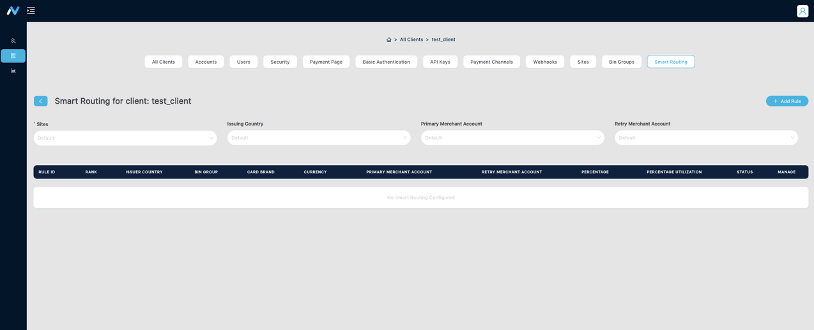
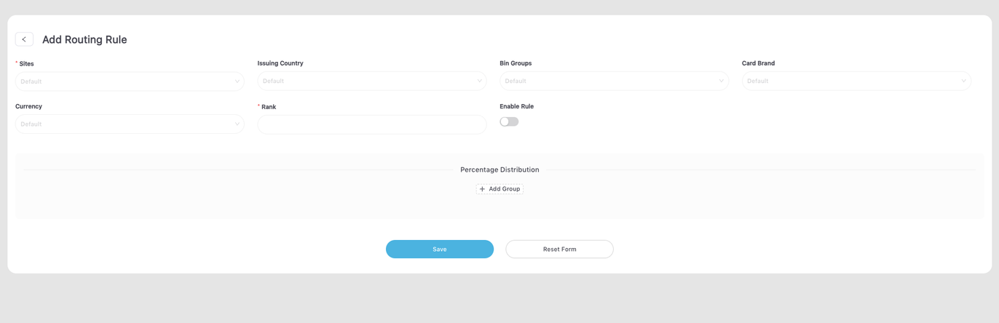
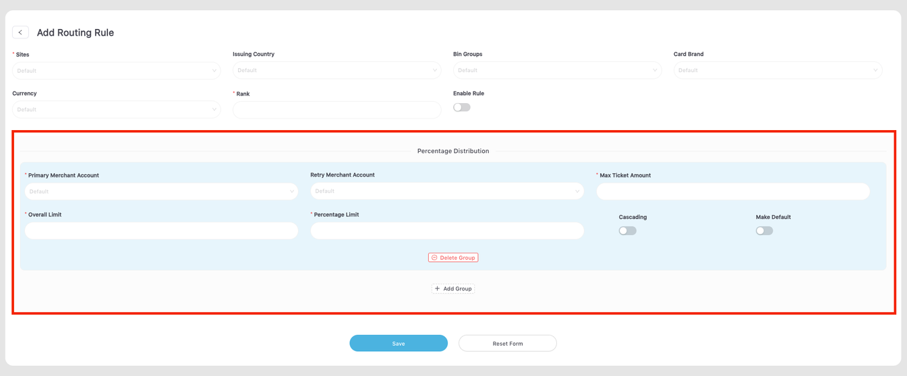
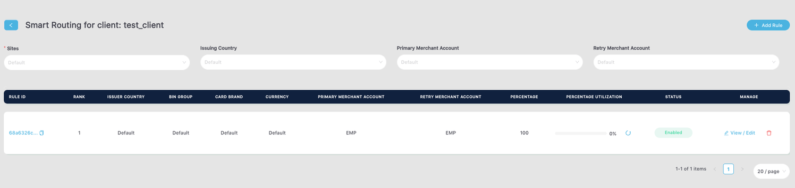

# Transaction Routing Rules

## Steps for Adding a Transaction Rule

1. After logging in to your account, navigate to the Smart Routing page.

2. Click on the "Add Rule" button.
3. Fill in the required details:

a. **Site**. Configure a rule for the Site listed in the dropdown menu.
b. **Rank**. Indicate the rank of the rule.

:::warning Important Notes
- The dropdown menus for Sites and Bin Groups will be populated with the configurations set during the initial setup.
- Multiple rules can be configured for a single site.
- Only one rank can be assigned per rule. Therefore, adding another rule with rank 1 is **not possible** if there is already an existing rule with the same rank.
:::

c. **Percentage Distribution**. Adding a Percentage Distribution.

Required details:

- **Primary Merchant Account**. The default merchant is to be utilized for transaction routing.
- **Max Ticket Amount**: This option allows for configuring the maximum monetary value that can be processed in a single transaction through a particular percentage distribution.
- **Overall Limit**. This option provides the ability to set a specific limit for the total number of transactions that can be processed through a particular percentage distribution.
- **Percentage Limit**: This option allows you to configure the allocation percentage of a specific percentage distribution in comparison to others within the same rule.

:::warning Important Note
- At least one (1) Percentage Distribution is required.
- Multiple Percentage Distributions can be added, ensuring that the total percentage limit across all distributions equals 100%.
:::

4. Review the rule settings to ensure they meet your requirements.

5. Save the rule by clicking on the "Save" button.

Following these steps will enable you to successfully add a transaction routing rule. It's crucial to thoroughly test and validate your modifications to ensure their proper functionality.

## Steps for Editing a Transaction Rule

1. Begin by locating the specific transaction rule that requires editing.
2. Click on the rules “View/Edit” button to access the form and make necessary adjustments.
3. Review and adjust the relevant settings as needed. Please follow the instructions provided above for **adding a transaction rule**.
4. Once you have completed your edits, ensure that you save your changes by clicking the "Save" button.

By following these steps, you will have successfully edited a transaction rule. It is important to thoroughly test and validate your modifications to ensure their proper functionality.

## Steps for enabling/disabling smart routing for specific clients or account

- Smart routing needs to be enabled at the Netvalve level: By default, the global flag for smart routing is enabled within the Netvalve microservice.
- Smart routing needs to be enabled at the Client/Account level: Smart routing functionality is disabled by default for specific clients/accounts. To enable smart routing for a particular client/account, the flag needs to be set via the Back Office Portal by a Netvalve Admin. Please contact the Netvalve Admin to request the activation of smart routing for your client/account. 

- Smart routing retry needs to be enabled at the Netvalve level:- The global flag for smart routing is set within the Netvalve microservice, and by default, it is disabled.
- Smart routing retry needs to be enabled at the Client/Account level:- Smart routing for specific clients/accounts can be enabled via the Back Office Portal by a Netvale Admin. By default, this feature is disabled. Please reach out to the Netvalve Admin to request the activation of smart routing for your client/account.