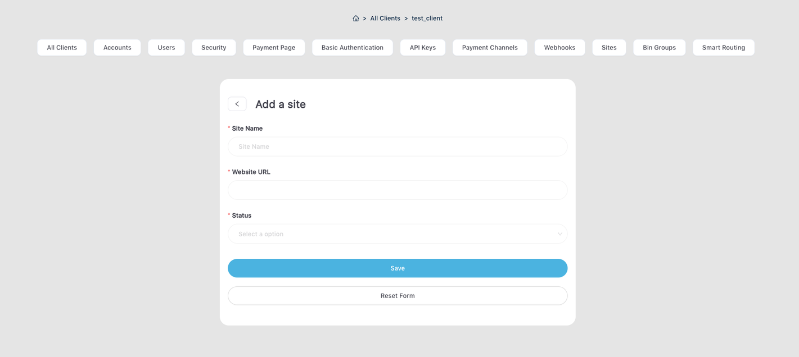
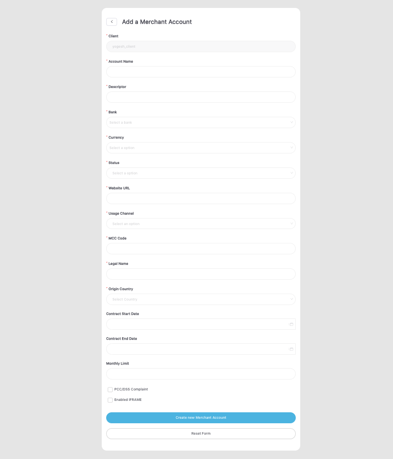
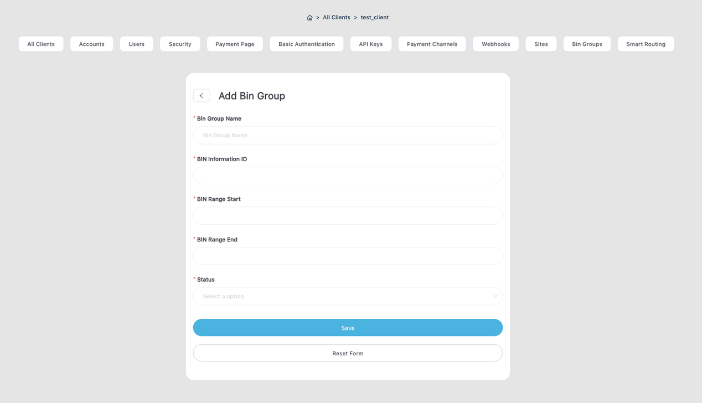

# Smart Routing Configuration

Transaction routing in finance directs financial transactions between entities, ensuring smooth fund flow and efficient payment processing. It determines the optimal path based on factors like cost, speed, security, and reliability. Organizations minimize costs, reduce risks, and enhance efficiency by selecting the right route.

In today's complex landscape, transaction routing connects payment systems and enables interoperability among stakeholders. It is vital for secure fund movement globally, settling payments promptly while mitigating fraud or system failures.

Transaction routing provides more control over your payments. It allows for the customization of payment flows based on the issuer country, currency, card brands, flexible load distribution, lower transaction costs, and the use of retry and cascading in case of provider downtime.

## Key Features of Transaction Routing

1. **Load Distribution**  
This feature enables the distribution of transaction loads across multiple merchant accounts and processing banks. It provides merchants with a way to minimize risk and maximize their processing volumes.

2. **Routing Based on Issuer Country** 
This feature enables merchants to strategically direct transactions according to the country of the card issuer. It provides valuable assistance to merchants in effectively managing risks associated with various countries and geo-locations.

3. **Routing Based on Currenc**y 
This feature enables merchants to efficiently route transactions based on the currency involved. By doing so, it empowers merchants to effectively manage and mitigate risks associated with different currencies.

4. **Routing Based on Card Brand** 
This feature enables merchants to route transactions based on the card brand, providing them with a valuable tool to mitigate risk and optimize processing volumes.

5. **Routing Based on Card BIN** 
This feature enables merchants to efficiently route transactions based on card BIN (Bank Identification Number), thereby minimizing risk and maximizing processing volumes.

6. **Retry Payment** 
This feature facilitates the automatic retry of transactions in the event of errors, including failures, false positive declines, and system errors.

7. **Cascading** 
This feature enhances the likelihood of successful transactions. In the event that a transaction fails, cascading will automatically redirect it to alternative providers.

## Authorized Users for Transaction Routing Configuration

The following users have access and the ability to configure transaction routing: **NetValve Admin**.

## Required Configurations

Before adding a transaction routing rule, it is important to configure certain settings. These configurations will be required for future use.

1. **Configure a Site**. The user is required to configure at least one Site.

2. **Configure a Merchant Account**. The user is required to configure at least one Merchant Account.

## Optional Configurations

To further customize your settings, you have the option to make certain configurations.

1. **Bin Groups**. The user will have the option to configure at least one Bin Group.

