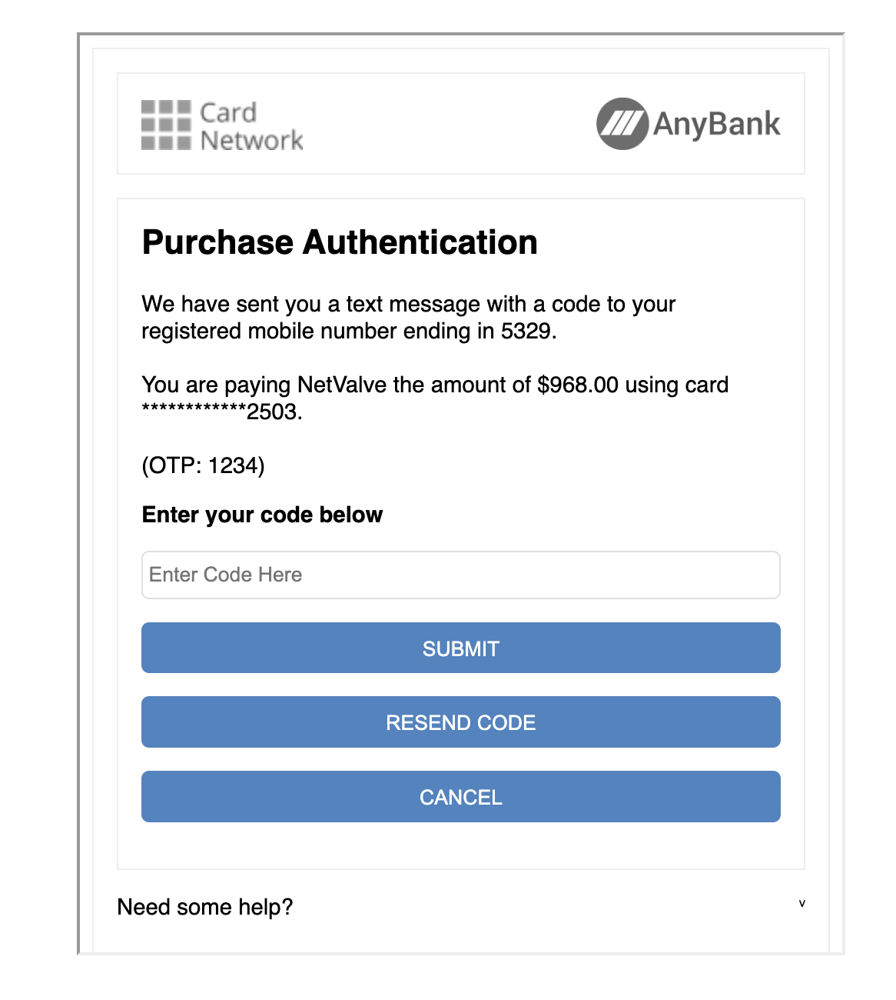

# V2 ACS Challenge (Flows B, C)

This step is only required if the response from the Initialisation API or the Auth API (Flow B) indicates the <code>challengeRequired</code> property is set to <code>true</code>, and the status is <code>ACS_REQUIRED</code>. 

This response should contain another <code>redirectUrl</code> property.

There are two options:

1. Perform a full browser redirect to ACS challenge page (If a <code>merchantRedirectUrl</code> was present in the [[3DS Initialisation API](initialisation-api.md) request body.)

2. Use an ACS challenge iframe.

## Option 1: Perform a Full Browser Redirect

Use the <code>redirectUrl</code> in the response to perform a browser redirect, where the ACS challenge will be hosted. 

Once the challenge is complete, the user will be redirected back to the merchant site.

The <code>transID</code> can be extracted from the URL parameters, appended to the merchant’s URL. This is what the URL might look like:

```html
https://merchantsite?result=SUCCESS&transID=6b65860e-a9ee-416d-b8a9-e6b674634470&threeDsStatus=ACS_COMPLETED
```

:::note
A <code>merchantRedirectUrl</code> must have been initially supplied in the Initialisation API.
:::

Once the <code>transID</code> has been extracted from the URL, it can be used to call the [Result API](v2-3ds-result.md).

## Option 2: Use an ACS challenge iframe

If a <code>merchantRedirectUrl</code> was not supplied, create an iframe to contain the ACS challenge.

### Set up Iframe HTML

Use the <code>redirectUrl</code> as the <code>src</code> property. Example iframe code:
```html
<iframe
    src={redirectUrl}
    title="ACS"
    style="width: 100%; height: 100vh">
    	
</iframe>
```

### Iframe Width and Height

The default size of the challenge iframe will be full screen. However, if the <code>acsWindowSize</code> property was specified in the 3DS init call, then the iframe must have the same width and height as the <code>acsWindowSize</code> provided.



### Create a POST Message Event Listener

The merchant site needs to know when the challenge is complete, and can proceed to call the 3DS Result API. This done via a [window.postMessage](https://developer.mozilla.org/en-US/docs/Web/API/Window/postMessage) from the iframe. 

Create an event listener on the page to receive this event. For security purposes, make sure to check the origin of the message and that it comes from the NetValve's domain.

```js
const handlePostEvent = (event) => {
  if (event.origin === 'https://3dsecuresuite.uat.sandbox-netvalve.com') {
      const data = event.data;
      // Use the data to perform STEP 3 
  }
};

// Be sure to attach the listener
window.addEventListener('message', handlePostEvent, false);
```

### Extract the Message Data

Inside the <code>event.data</code> is the following object. The expected status is <code>ACS_COMPLETED</code>.

```js
{
    result: 'SUCCESS',
    threeDsResponse: {
        status: 'ACS_COMPLETED',
        transID: 'abc',
        providerErrorMessage: ''
    };
};
```
Once the message is received, in both cases success or fail, proceed to call the [Result API](v2-3ds-result.md).

## Expected Properties and Values

<code>result :  'SUCCESS' | 'ERROR'</code> - Use this for error handling. 

:::note 
SUCCESS refers to the success of the 3DS initialization step. It does not mean that the 3DS values have been retrieved.
:::

- <code>status  :  'ACS_COMPLETED' | 'ERROR' | 'CALLBACK_PROCESSING_ERROR' | 'TIMEOUT' | 'INVALID_TRANS_ID' | 'MAX_IFRAME_RELOADS'</code> 
- <code>transID</code> is the 3DS transaction ID;
- <code>providerErrorMessage</code> will contain the error message from the 3DS provider, if any.

## Proceed to Fetch the Result

Proceed further to call the [V2 3DS Result API (Flows B, C)](v2-3ds-result.md).
