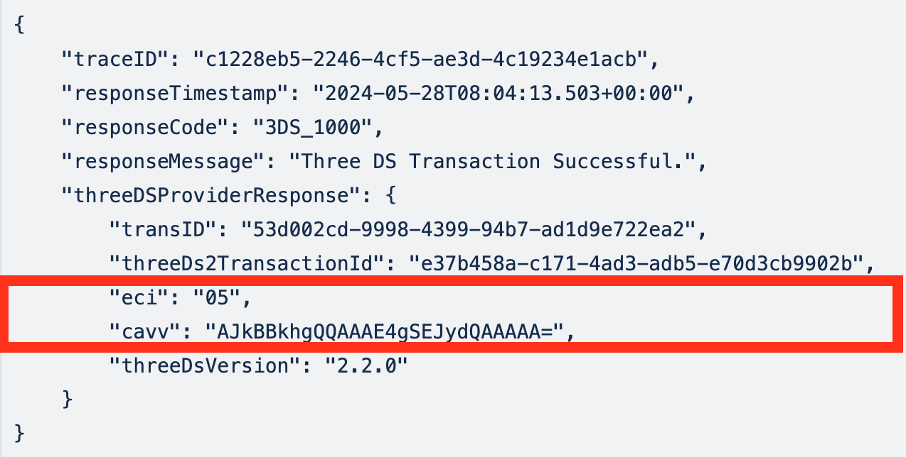
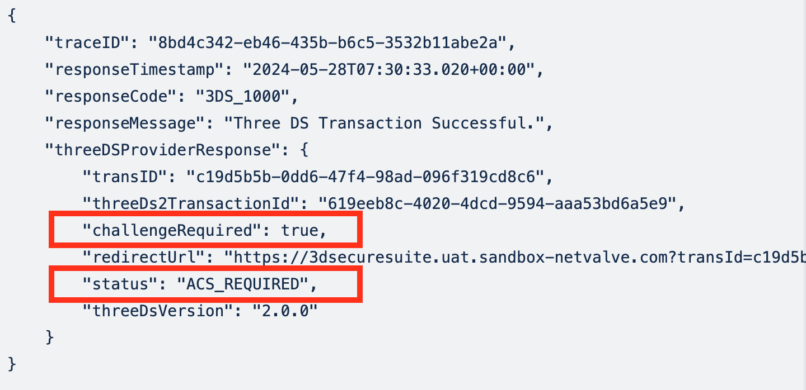
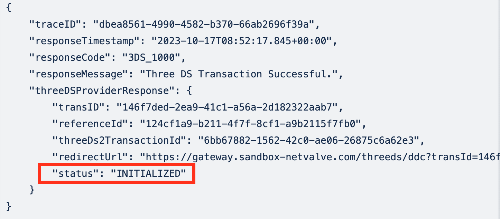

# V2 Flows

Once the Initialisation API has been called, the response will indicate which flow to begin. 

:::note
**If the merchant’s 3DS Provider is Cardinal, Flow C is irrelevant and can be disregarded.**
:::

## Flow A: 3Ds complete

If the response contains ECI and CAVV values, the 3DS step is complete and the merchant can proceed to call the SALE API with these values. 



For more details refer to the [V2 Add 3DS fields in Sale API (Flows A, B, C)](v2-add-3ds-fields.md) document.

## Flow B: Challenge Required 

If the threeDSProviderResponse has a status of <code>ACS_REQUIRED</code> (or alternatively, check for the <code>challengeRequired property)</code>, redirect to the URL provided in the <code>redirectUrl</code> property.



The user will land on a 3DS challenge page. After authenticating, the user will be redirected back to the <code>merchantRedirectUrl</code> which was provided by the merchant in the [Initialisation API](initialisation-api.md) request body.

From there, the merchant can extract the <code>transID</code> value and use it to call the [Result API](v2-3ds-result.md) to get the result of the 3DS challenge, and retrieve the <code>eci</code> and <code>cavv</code> values required for the sale operation. 

For more detailed information, refer to the following documents:

- [V2 ACS challenge (Flows B, C)](v2-acs-challenge.md);
- [V2 3DS Result API (Flows B, C)](v2-3ds-result.md);
- [V2 Add 3DS fields in Sale API (Flows A, B, C)](v2-add-3ds-fields.md).

## Flow C: device data collection required

If the initialization response has a status of <code>INITIALIZED</code>, it indicates that the merchant must perform device data collection inside a hidden iframe on the page.



The merchant must use the <code>redirectUrl</code> value to [setup a hidden iframe](v2-create-iframe.md), and listen for a Post Message Event. If successful, proceed to call the [Auth API](v2-3ds-auth.md).

The Auth API response will indicate 2 possible flows - Flow A and Flow B described above. The response structure and properties are exactly the same as the initialization response.

For more detailed information, refer to the following documents:

- [V2 Create Device Data Collection Iframe (Flow C)](v2-create-iframe.md);
- [V2 3DS Auth API (Flow C)](v2-3ds-auth.md).

## Example Logic for the Flows

Here is a minimal example of the logic that would be used to determine which flow to begin:

```js
// START 3DS Flow
const response = await initialize(); 
if (response.responseCode !== '3DS_1000') return handleError(response);
else if (response.threeDSProviderResponse.eci && response.threeDSProviderResponse.cavv) // Flow A - 3DS complete
    sale(response.threeDSProviderResponse);
else if (response.threeDSProviderResponse.status === 'ACS_REQUIRED') // Flow B - challenge required
    redirectToChallengePage(response);
else if (response.threeDSProviderResponse.status === 'INITIALIZED') // Flow C - device data collection required
    deviceDataCollection(response); 
```