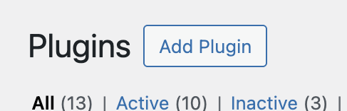
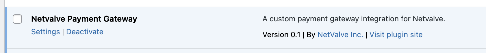
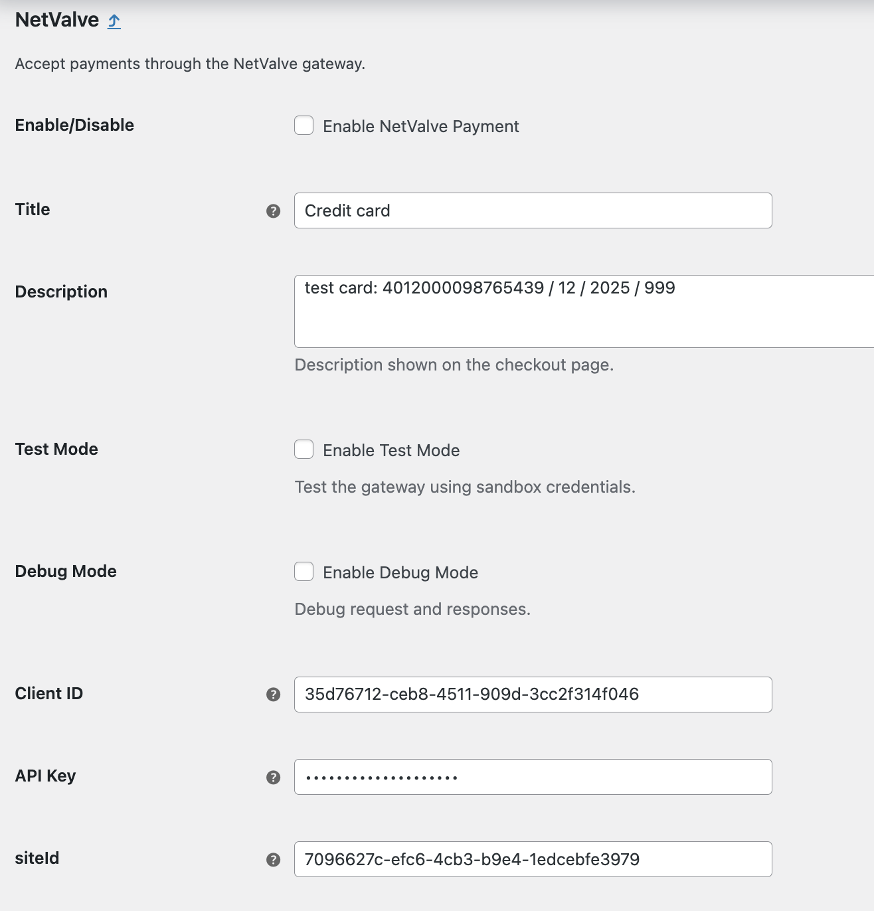

# WooCommerce Plugin

## Plugin Installation

Your NetValve contact will supply you with the plugin in a ZIP archive.

1. Navigate to the Plugins page in your WordPress admin panel.
2. Click the **Add Plugin** button, located at the top of the page; then click the **Upload Plugin** button and select the provided NetValve plugin archive.

3. Upload the NetValve plugin file for installation.

You should now see the Netvalve Payment Gateway plugin in the list of installed plugins.

## Configuration

On the WordPress Plugins page click the **Settings** link under the Netvalve Payment Gateway plugin name.

The following page will appear. 

Use the guidelines below to set up the plugin in your environment in order to accept payments via the NetValve gateway.

| Option | Description |
|:-------| :---------- |
|Enable/Disable |This checkbox enables/disables the NetValve payment options on your website. |
|Description |Any description you want to show your customers during the payment flow. |
|Test Mode | Enable this, if your credentials are for the NetValve sandbox. |
|Debug Mode |In case of something not working, enabling this checkbox will write to a server log all actions, requests and responses happening, which can help tracing down the issue. |
|Client ID |Enter the value provided by NetValve for your configuration. |
|API Key |Enter the value provided by NetValve for your configuration. |
|siteId |Enter the value provided by NetValve for your configuration.|

### Apple Pay™ Integration

On the Netvalve Payment Gateway plugin settings page you have the option to enable ApplePay.

Follow the instructions provided by Apple to create certificates, and setup a sandbox device for testing the integration: [Sandbox Testing - Apple Pay](https://developer.apple.com/apple-pay/sandbox-testing/).

Also refer to the [NetValve Apple Pay™ integration](apple-pay.md) documentation.

#### Apple Pay™ Testing

You will need an iOS device in sandbox mode, with a test card enabled in the apple wallet. For more details refer to the [Sandbox Testing - Apple Pay](https://developer.apple.com/apple-pay/sandbox-testing/) documentation.